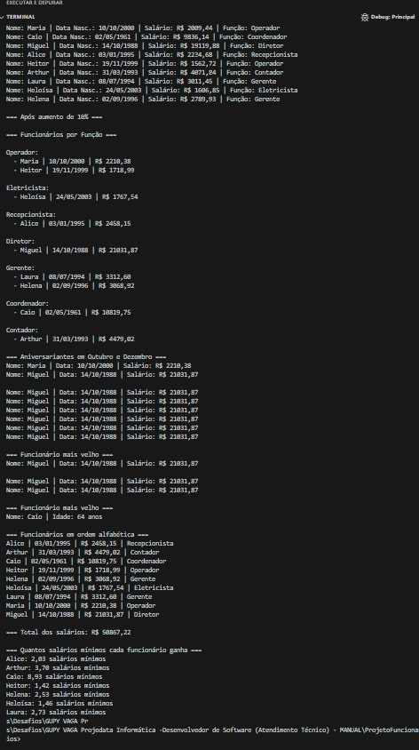
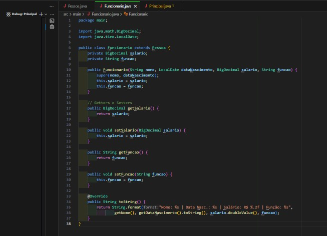

# 🧑‍💻 Desafio Prático Java — Projedata Informática


> 💡 Um projeto completo em Java para gestão de funcionários, desenvolvido como parte do processo seletivo para a vaga de **Desenvolvedor de Software (Atendimento Técnico) — Júnior** na **Projedata Informática**.


---

## 🎯 Sobre o Projeto

Este repositório contém a solução completa para o desafio prático proposto pela **Projedata Informática**, onde foi necessário implementar um sistema de gestão de funcionários com diversas operações, como inserção, remoção, formatação, cálculos e agrupamento.

Todas as funcionalidades foram implementadas conforme especificado, utilizando conceitos de **Orientação a Objetos (OOP)**, **Collections (List, Map, Stream API)**, **formatação de datas e valores monetários**, e boas práticas de programação.

---

## 🔧 Tecnologias Utilizadas

- 🟦 **Java 17** – Linguagem principal
- 🔄 **OOP (Orientação a Objetos)** – Herança, encapsulamento
- 📂 **Collections** – List, Map, ArrayList
- 📊 **Stream API** – Para filtragem e agrupamento
- 📅 **LocalDate** – Manipulação de datas
- 💸 **BigDecimal** – Cálculos precisos de salários
- 🖥️ **Terminal (CMD/PowerShell)** – Execução manual via linha de comando

---

## ✅ Funcionalidades Implementadas

| Requisito | Status |
|---------|--------|
| Classe `Pessoa` com nome e data de nascimento | ✅ |
| Classe `Funcionario` herdando de `Pessoa` | ✅ |
| Inserção de todos os funcionários (10) | ✅ |
| Remoção do funcionário "João" | ✅ |
| Impressão formatada (dd/mm/aaaa, R$ X.XXX,XX) | ✅ |
| Aumento de 10% no salário de todos | ✅ |
| Agrupamento por função (Map<String, List<Funcionario>>) | ✅ |
| Impressão de aniversariantes de outubro e dezembro | ✅ |
| Identificação do funcionário mais velho | ✅ |
| Ordenação alfabética dos funcionários | ✅ |
| Cálculo do total dos salários | ✅ |
| Cálculo de quantos salários mínimos cada funcionário ganha | ✅ |

---

## 📁 Estrutura do Projeto
desafio-java-projedata-funcionarios/
├── ProjetoFuncionarios/
│ └── src/
│ └── main/
│ ├── Pessoa.java
│ ├── Funcionario.java
│ └── Principal.java
├── Relatório - Desafio Java - Projedata Informática.html
├── Relatório 2.html
├── print1.jpg
└── print2.jpg

---

## 🖥️ Como Executar

1. Abra o terminal na raiz do projeto.
2. Compile os arquivos:
   ```bash
   javac -d . ProjetoFuncionarios/src/main/*.java
Execute o programa :
java main.Principal


📌 Observação: O código está organizado com pacote main, então é necessário usar main.Principal. 
📷 Prints de Execução
🖼 Print1: Saída do programa após compilação e execução



🖼 Print2: Comandos digitados no terminal




📄 Relatório Completo
👉 [Clique aqui para ver o Relatório em HTML](Relatorio 2.html)

[Relatório do Desafio Java](Relatório - Desafio Java - Projedata Informática.html)

## Relatórios do Projeto

- [Relatório HTML - Parte 1](Relatorio 2.html)
- [Relatório HTML - Desafio Java](Relatório - Desafio Java - Projedata Informática.html)


🎯 Autor
Sandro Luis de Paula Junior
📧 sandro.sd.luis@gmail.com
📱 WhatsApp
💻 GitHub


Tags (Topics)
#java #oop #desafio-tecnico #junior-developer #programacao #projedata #funcionarios #stream-api #bigdecimal #localdate #collections #desenvolvimento-deftware
